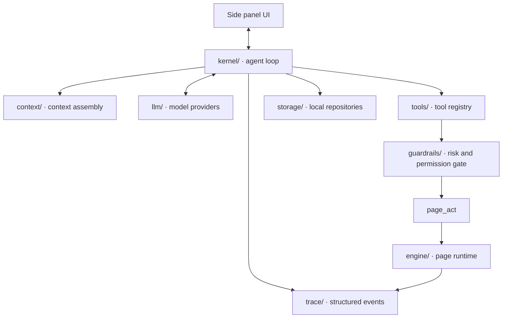

<div align="center">

# Browser Agent

**An open-source runtime for browser agents.**

Bring your own model into the browser, with context assembly, typed tools, page execution, DOM verification, guardrails and reusable skills.

[](../../actions)
[](packages/extension/package.json)
[](LICENSE)
[](packages/extension)
[](packages/extension/tsconfig.json)
[](CONTRIBUTING.md)

[English](README.md) · [简体中文](README.zh-CN.md)

</div>

---

## What this is

Browser Agent is a Chrome MV3 extension and a runtime for browser agents. It places a model inside a structured browser environment: the model interprets the task and chooses actions; the runtime provides page context, exposes tools, executes actions, verifies results, records traces and controls risk.

The repository is mainly about the infrastructure around the model:

- **Context**: current tab, open tabs, page summaries, session history and system constraints assembled into model input.
- **Tools**: page, tabs, browser data, skills and MCP exposed as typed tools.
- **Execution**: fills, clicks, selections, uploads and navigation inside real web pages.
- **Verification**: post-action checks against the live DOM.
- **Guardrails**: risk tiers, site policies, authorization memory, confirmation prompts and audit logs.
- **Reuse**: verified workflows extracted into skills for replay and batch execution.

The product surface today is a browser side panel. The core of the project is the runtime behind it: the agent loop, tool registry, page engine and verification system.

## Design goals

Browser Agent is designed around engineering boundaries for browser automation, not just a conversational interface.

**1. A web page is a runtime environment, not only an image.**  
The engine captures whole-page semantic snapshots: DOM nodes, accessible names, form values, interactivity, occlusion, same-origin iframes and open shadow roots. The model receives a representation closer to the browser's actual structure than a viewport screenshot alone.

**2. Tool calls go through one registry.**  
All tools are registered as `ToolDefinition` objects. Parameters are defined with Zod schemas, risk tiers are declared in the tool definition, and execution passes through validation, permission checks, site policy and audit logging. Built-in tools and MCP tools use the same entry point.

**3. Page actions need explicit completion checks.**  
After `page_act` executes an action, it checks post-conditions such as value written, text present, URL matched or list count changed. Success and failure both return expected values, actual values and evidence, instead of only a natural-language summary.

**4. Successful workflows should become reusable capabilities.**  
A verified run can be extracted into a skill. Skill replay still verifies each step and uses bounded recovery attempts when something changes. Batch execution runs the skill row by row and reconciles the report against page state.

## Architecture



Main modules under `packages/extension/src/`:

```text
kernel/       agent loop: assemble context, stream the model, dispatch tools, feed tool results back
context/      context assembly: system prompt, current tab, open tabs, session history
tools/        tool registry: page, tabs, browser data, skills, MCP
engine/       page runtime: perception, grounding, widget adapters, execution, verification, failure handling
guardrails/   tool guardrails: risk tiers, authorization memory, site policies, confirmations, audit
storage/      local repositories: sessions, runs, skills, batches, provider configs, settings
trace/        structured events shared by the kernel and engine
llm/          model ports: OpenAI-compatible, OpenAI Responses, Anthropic, mock provider
ui/           side panel, options page, onboarding and shared components
```

Two runtime choices are important:

- **The agent loop runs in the side panel.** MV3 service workers can be suspended by the browser, so the side panel is a more suitable host for model calls and multi-step tool runs while the user keeps it open.
- **The page engine does not depend on Chrome APIs.** Logic under `engine/page/` can run when injected into a page, in tests and in the benchmark, so the same implementation is exercised across environments.

## The `page_act` execution model

`page_act` is the unified entry point for page work. It turns a page-level goal into actions with checks, instead of only sending clicks and keystrokes to the page.

The execution pipeline has six layers:

1. **Perception**: capture a whole-page semantic snapshot with roles, names, values, interactivity, occlusion, iframes and shadow roots.
2. **Grounding**: locate target elements by semantic fingerprints made of roles, names, attributes, structure and anchors, and re-locate after re-renders.
3. **Execution**: run React/Vue-compatible event sequences through the `dom` channel; use the `cdp` channel for coordinate input and file uploads when needed.
4. **Verification**: evaluate post-conditions in the page, including `value_equals`, `element_exists`, `text_present`, `url_matches`, `list_count_delta` and `element_state`.
5. **Failure handling**: choose bounded strategies based on failure reason, such as waiting for readiness, re-locating, scrolling, dismissing overlays, switching channels or replanning.
6. **Trace**: write actions, check results, expected values, actual values and evidence into structured events for UI, tests and debugging.

For example, when creating a customer, a success toast is not the final condition. The engine also checks that the customer list gained a row and that the expected name appears in the list. If no record appears, the result includes an actionable verification failure such as `list_count_delta: expected +1, got 0`.

## Tool system

Tool definitions live in `packages/extension/src/tools/`. A tool declares:

- An id and model-facing description.
- A Zod parameter schema.
- A risk tier: `read`, `act` or `dangerous`.
- Optional Chrome permissions.
- An execution handler.

After registration, a tool is available to configured model providers. Execution is wrapped with parameter validation, permission requests, guardrails, audit logging and error handling.

```ts
import { z } from 'zod';
import type { ToolDefinition } from '@/kernel/contracts/tool';

export const readClipboard: ToolDefinition<{ trim?: boolean }> = {
  id: 'clipboard_read',
  titleKey: 'tools.clipboard_read',
  description: 'Read the current clipboard text. Use when the user refers to "what I copied".',
  paramsSchema: z.object({ trim: z.boolean().optional() }),
  riskTier: 'read',
  requiredPermissions: ['clipboardRead'],
  async execute(params) {
    const text = await navigator.clipboard.readText();
    return { ok: true, summary: params.trim ? text.trim() : text };
  },
};
```

Built-in packs:

| Pack | Tools |
|---|---|
| Page | `page_act` · `page_read` · `page_screenshot` |
| Tabs | `tabs_list` · `tabs_open` · `tabs_activate` · `tabs_close` |
| Browser data | `history_search` · `bookmarks_search` · `bookmarks_add` · `downloads_list` · `downloads_save` |
| Skills | `skills_list` · `skills_run` · `batch_start` |
| MCP | Mount Streamable HTTP MCP servers; remote tools pass through local guardrails |

## Skills and batch execution

A skill is a reusable workflow extracted from a successful run. It contains parameter slots, pre-bound steps and verification conditions for each step.

Batch execution passes each row of a data table into a skill. Rows run independently and are verified independently. Failed rows do not block the rest of the batch, and can be retried after data fixes. The delivery report is reconciled against page state rather than only counting attempted executions.

This logic lives in `packages/extension/src/engine/batch/` and `packages/extension/src/tools/skills.ts`.

## Model providers

Model providers are implemented under `llm/`. Current providers include:

- OpenAI-compatible Chat Completions.
- OpenAI Responses API.
- Anthropic Messages API.
- Scripted mock provider for tests.

If an endpoint does not support native tool calling, the runtime falls back to a prompted-JSON protocol and normalizes the output into the same internal tool-call structure. The tool registry, guardrails and kernel loop do not need separate paths per provider.

## Security and privacy

- No backend and no telemetry.
- Model requests go directly from the browser to the endpoint configured by the user.
- API keys are stored in `chrome.storage.local`.
- Browser history, bookmarks and downloads are optional permissions requested only on first use.
- Every tool call is written to the audit log.
- High-risk actions such as submit, pay, delete and send require confirmation.
- Bot challenges stop the run and return control to the user.

## Quick start

```bash
git clone https://github.com/browser-agent/browser-agent.git
cd browser-agent
pnpm install
pnpm build
```

After the build, open `chrome://extensions`, enable Developer mode, choose Load unpacked, and load:

```text
packages/extension/.output/chrome-mv3
```

On first install, the onboarding page asks for a model provider. Choose a preset, enter the base URL and key, test the connection, and save.

Local practice site:

```bash
pnpm fixtures
```

Then open `http://localhost:4173`.

## Development commands

```bash
pnpm build          # build fixtures and extension, then typecheck bench/e2e
pnpm dev:ext        # extension dev mode
pnpm dev:fixtures   # local fixture site dev mode
pnpm test:engine    # engine tests
pnpm test:e2e       # extension e2e with scripted mock provider
pnpm shots          # UI screenshot sweep
pnpm bench          # regenerate docs/benchmark.md
```

On Windows, if Playwright cannot find a browser, set `PLAYWRIGHT_BROWSERS_PATH` to your local `ms-playwright` cache directory.

## Tests and benchmark

`pnpm test:engine` covers page perception, element grounding, widget adapters, verification and failure handling.

`pnpm test:e2e` builds a mock version of the extension and drives the full chat and tool-call loop with a scripted mock provider. It does not need a real model API key.

`pnpm bench` runs a reproducible benchmark on the same fixtures. The current report is in [`docs/benchmark.md`](docs/benchmark.md). It covers custom widgets, fake-success detection, injected flakiness, off-screen fields and batch delivery accuracy.

## Extension points

Useful contribution areas:

- **Tool packs** for specific sites, browser capabilities or developer workflows.
- **Context providers** that add new context layers for the model.
- **Widget adapters** for dropdowns, date pickers, uploads and cascaders in more component libraries.
- **Verification kinds** for new page post-conditions.
- **Model ports** for additional model APIs.
- **Fixture scenarios** for more real-world page structures and failure modes.

Before opening a PR, run:

```bash
pnpm build
pnpm test:engine
```

If the change affects chat, settings, permission prompts or extension loading, also run `pnpm test:e2e`.

## Project layout

| Package | Description |
|---|---|
| [`packages/extension`](packages/extension) | Chrome MV3 extension |
| [`packages/fixtures`](packages/fixtures) | Local practice and test pages |
| [`packages/e2e`](packages/e2e) | Engine tests, extension e2e and screenshot sweep |
| [`packages/bench`](packages/bench) | Benchmark runner |
| [`docs/architecture.md`](docs/architecture.md) | Architecture notes |
| [`docs/benchmark.md`](docs/benchmark.md) | Benchmark report |

## License

[MIT](LICENSE)
