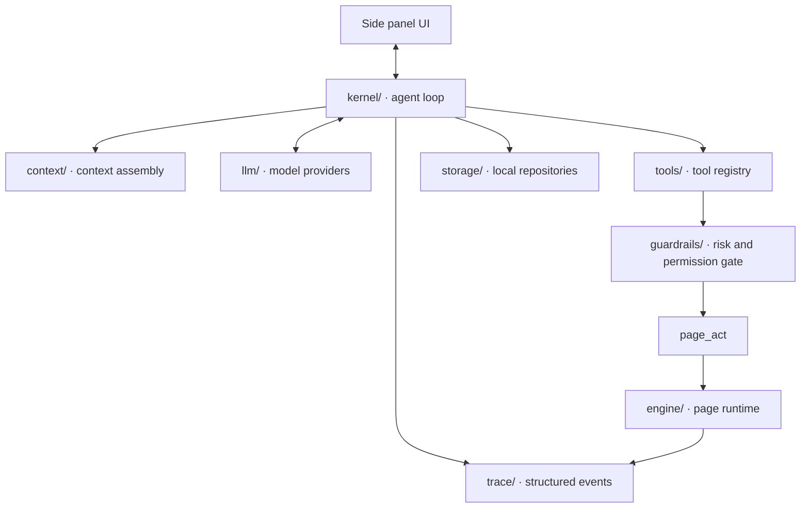

<div align="center">

# Browser Agent

**浏览器 Agent 的开源运行框架。**

把模型接入真实网页，并提供上下文、工具、页面执行、结果验证、权限护栏和技能复用。

[](packages/extension/package.json)
[](LICENSE)
[](packages/extension)
[](packages/extension/tsconfig.json)
[](CONTRIBUTING.md)

[English](README.md) · [简体中文](README.zh-CN.md)

</div>

---

## 这是什么

Browser Agent 是一个 Chrome MV3 扩展，也是一个浏览器 Agent runtime。它把“模型”放在一个完整的浏览器运行环境里：模型负责理解任务和规划动作，runtime 负责提供页面上下文、暴露工具、执行动作、检查结果、记录过程和控制风险。

换句话说，这个仓库主要做的不是再做一个聊天界面，而是实现浏览器 Agent 需要的基础设施：

- **上下文层**：把当前标签页、打开的标签页、页面摘要、会话历史和系统约束整理成模型可用的输入。
- **工具层**：把页面、标签页、浏览器数据、技能和 MCP 工具统一成 typed tool，交给模型调用。
- **执行层**：在真实网页里执行填写、点击、选择、上传等动作。
- **验证层**：动作结束后读取真实 DOM，用明确的检查项判断页面是否达到预期状态。
- **护栏层**：根据风险等级、站点策略、权限记忆和二次确认决定工具能不能执行。
- **复用层**：把验证通过的页面流程提取成技能，用于后续重复执行和批量任务。

产品形态目前是一个浏览器侧边栏，但核心价值在运行框架。UI 负责承载对话和展示证据；真正重要的是背后的 agent loop、工具注册表、页面引擎和验证体系。

## 设计目标

Browser Agent 的设计目标不是让模型“看起来会操作网页”，而是让浏览器里的 Agent 行为具备可检查的工程边界。

**1. 页面不是一张截图，而是可查询的运行环境。**  
引擎会采集整页语义快照，包含 DOM 节点、可访问名称、表单值、可交互状态、遮挡信息、同源 iframe 和 open shadow root。这样模型拿到的不是一张当前视口图片，而是更接近浏览器真实结构的页面表示。

**2. 工具调用必须经过统一入口。**  
所有工具都从 `ToolDefinition` 注册，参数由 Zod schema 定义，风险等级在工具定义里声明，执行前统一经过参数校验、权限检查、站点策略和审计记录。无论是内置工具还是 MCP 工具，都走同一套入口。

**3. 页面操作要有可验证的结束条件。**  
`page_act` 执行动作之后，会检查后置条件，例如输入值是否写入、文本是否出现、URL 是否匹配、列表行数是否变化。成功或失败都返回预期值、实际值和证据，而不是只返回一段自然语言总结。

**4. 成功流程应该能沉淀为能力。**  
一次验证通过的页面流程可以提取成技能。技能回放时仍然逐步验证，失败时按预算尝试等待、重新定位、滚动、关闭遮挡层或切换执行通道。批量任务按行执行，并用页面状态核对交付结果。

## 架构



主要模块在 `packages/extension/src/`：

```text
kernel/       agent loop：组装上下文、流式调用模型、分发工具、回填工具结果
context/      上下文组装：系统提示、当前标签页、打开的标签页、会话历史
tools/        工具注册表：page、tabs、browser data、skills、MCP
engine/       页面运行时：感知、定位、控件适配、执行、验证、失败处理
guardrails/   工具护栏：风险等级、授权记忆、站点策略、二次确认、审计
storage/      本地仓储：会话、运行记录、技能、批量任务、模型配置、设置
trace/        kernel 和 engine 共用的结构化事件
llm/          模型端口：OpenAI 兼容、OpenAI Responses、Anthropic、mock provider
ui/           侧边栏、设置页、引导页和通用组件
```

运行拓扑上有两个关键点：

- **agent loop 跑在侧边栏里**。MV3 service worker 会被浏览器挂起，不适合承载较长的模型调用和多步工具执行；侧边栏在用户打开期间更稳定。
- **页面引擎不依赖 Chrome API**。`engine/page/` 下的逻辑可以注入真实页面，也可以在测试和 benchmark 中复用，避免测试代码和发布代码走两套实现。

## `page_act` 的执行模型

`page_act` 是页面任务的统一入口。它把一个自然语言页面目标转成一系列带验证的动作，而不是只把点击和输入直接交给页面。

执行过程分为六层：

1. **Perception**：采集整页语义快照，记录节点角色、名称、值、可交互性、遮挡状态、iframe 和 shadow root。
2. **Grounding**：用角色、名称、属性、结构和锚点组成语义指纹，在页面重渲染后重新定位目标元素。
3. **Execution**：通过 `dom` 通道执行 React/Vue 兼容的事件序列；必要时使用 `cdp` 通道处理坐标输入和文件上传。
4. **Verification**：在页面内检查后置条件，例如 `value_equals`、`element_exists`、`text_present`、`url_matches`、`list_count_delta`、`element_state`。
5. **Failure handling**：根据失败原因选择有限的处理策略，例如等待页面稳定、重新定位、滚动查找、关闭遮挡层、切换执行通道或重新规划。
6. **Trace**：把动作、检查结果、预期值、实际值和证据写入结构化事件，供 UI、测试和调试使用。

例如，新建客户时，成功提示不是最终判据。引擎还会检查客户列表是否新增记录、目标姓名是否出现在列表里。如果没有新增记录，运行结果会包含 `list_count_delta: expected +1, got 0` 这类可定位的问题。

## 工具系统

工具定义集中在 `packages/extension/src/tools/`。一个工具包含：

- `id` 和模型可读的描述。
- Zod 参数 schema。
- 风险等级：`read`、`act` 或 `dangerous`。
- 可选 Chrome 权限。
- 执行函数。

注册后，工具会自动出现在模型可调用的工具列表中。执行时统一经过参数校验、权限申请、guardrails、审计和错误包装。

```ts
import { z } from 'zod';
import type { ToolDefinition } from '@/kernel/contracts/tool';

export const readClipboard: ToolDefinition<{ trim?: boolean }> = {
  id: 'clipboard_read',
  titleKey: 'tools.clipboard_read',
  description: 'Read the current clipboard text. Use when the user refers to "what I copied".',
  paramsSchema: z.object({ trim: z.boolean().optional() }),
  riskTier: 'read',
  requiredPermissions: ['clipboardRead'],
  async execute(params) {
    const text = await navigator.clipboard.readText();
    return { ok: true, summary: params.trim ? text.trim() : text };
  },
};
```

内置工具包：

| 工具包 | 工具 |
|---|---|
| Page | `page_act` · `page_read` · `page_screenshot` |
| Tabs | `tabs_list` · `tabs_open` · `tabs_activate` · `tabs_close` |
| Browser data | `history_search` · `bookmarks_search` · `bookmarks_add` · `downloads_list` · `downloads_save` |
| Skills | `skills_list` · `skills_run` · `batch_start` |
| MCP | 挂载 Streamable HTTP MCP server，远程工具同样经过本地 guardrails |

## 技能和批量执行

技能是从一次成功运行中提取出来的可复用流程。它包含参数槽、预绑定步骤和每一步的验证条件。

批量执行时，`batch_start` 会把数据表中的每一行带入技能。每一行单独运行、单独验证、单独记录结果。失败行不会影响其他行；修正数据后可以重跑失败行。交付报告会和页面中的实际记录对账，避免只统计“执行了多少次”而不确认“页面里是否真的存在”。

这部分能力对应 `packages/extension/src/engine/batch/` 和 `packages/extension/src/tools/skills.ts`。

## 模型接入

模型能力通过 `llm/` 下的 provider 接入。当前包含：

- OpenAI-compatible Chat Completions。
- OpenAI Responses API。
- Anthropic Messages API。
- 测试用 scripted mock provider。

如果模型端点不支持原生 tool calling，系统会降级到 prompted-JSON 协议，并把结果转换成同一套内部 tool-call 结构。这样工具注册表、guardrails 和 kernel loop 不需要为每个模型端点改一套逻辑。

## 安全和隐私

- 没有后端，也没有遥测。
- 模型请求从浏览器直接发往用户配置的模型端点。
- API Key 存储在 `chrome.storage.local`。
- 历史、书签、下载等浏览器权限是 optional permissions，只有工具首次使用时才申请。
- 每次工具调用都会记录审计事件。
- 高风险动作，例如提交、支付、删除、发送，会触发二次确认。
- 遇到人机验证时，运行会停下来交还给用户处理。

## 快速开始

```bash
git clone https://github.com/uiuing/browser-agent.git
cd browser-agent
pnpm install
pnpm build
```

构建完成后，在 Chrome 中打开 `chrome://extensions`，开启开发者模式，选择“加载已解压的扩展程序”，加载：

```text
packages/extension/.output/chrome-mv3
```

首次安装会打开引导页。选择模型服务商模板，填写 Base URL 和 Key，测试连接后保存。

本地练习站：

```bash
pnpm fixtures
```

然后打开 `http://localhost:4173`。

## 开发命令

```bash
pnpm build          # 构建 fixtures 和扩展，并 typecheck bench/e2e
pnpm dev:ext        # 扩展开发模式
pnpm dev:fixtures   # 本地练习站开发模式
pnpm test:engine    # 引擎测试
pnpm test:e2e       # 扩展端到端测试，使用 scripted mock provider
pnpm shots          # UI 截图巡检
pnpm bench          # 重新生成 docs/benchmark.md
```

Windows 环境下，如果 Playwright 找不到浏览器，可以设置 `PLAYWRIGHT_BROWSERS_PATH` 指向本机的 `ms-playwright` 缓存目录。

## 测试和 benchmark

`pnpm test:engine` 覆盖页面感知、元素定位、控件适配、验证和失败处理。

`pnpm test:e2e` 会构建 mock 版本扩展，用 scripted mock provider 驱动完整聊天和工具调用流程，不需要真实模型 API Key。

`pnpm bench` 会在同一套 fixtures 上运行可复现 benchmark。当前报告在 [`docs/benchmark.md`](docs/benchmark.md)，覆盖自定义控件、假成功识别、抖动恢复、屏幕外字段和批量交付准确性。

## 扩展点

最适合贡献的方向：

- **工具包**：接入新的浏览器能力、网站能力或开发者工作流。
- **Context provider**：为模型增加新的上下文层。
- **控件适配器**：支持更多组件库里的下拉、日期、上传、级联选择等控件。
- **验证类型**：增加新的页面后置条件。
- **模型端口**：接入新的模型 API。
- **Fixture 场景**：覆盖更多真实网页结构和失败模式。

提交 PR 前请至少运行：

```bash
pnpm build
pnpm test:engine
```

如果改动影响聊天、设置页、权限弹窗或扩展加载流程，也请运行 `pnpm test:e2e`。

## 项目结构

| 包 | 说明 |
|---|---|
| [`packages/extension`](packages/extension) | Chrome MV3 扩展主体 |
| [`packages/fixtures`](packages/fixtures) | 本地练习和测试页面 |
| [`packages/e2e`](packages/e2e) | 引擎测试、扩展 e2e、截图巡检 |
| [`packages/bench`](packages/bench) | benchmark runner |
| [`docs/architecture.md`](docs/architecture.md) | 架构说明 |
| [`docs/benchmark.md`](docs/benchmark.md) | benchmark 报告 |

## 许可证

[MIT](LICENSE)
