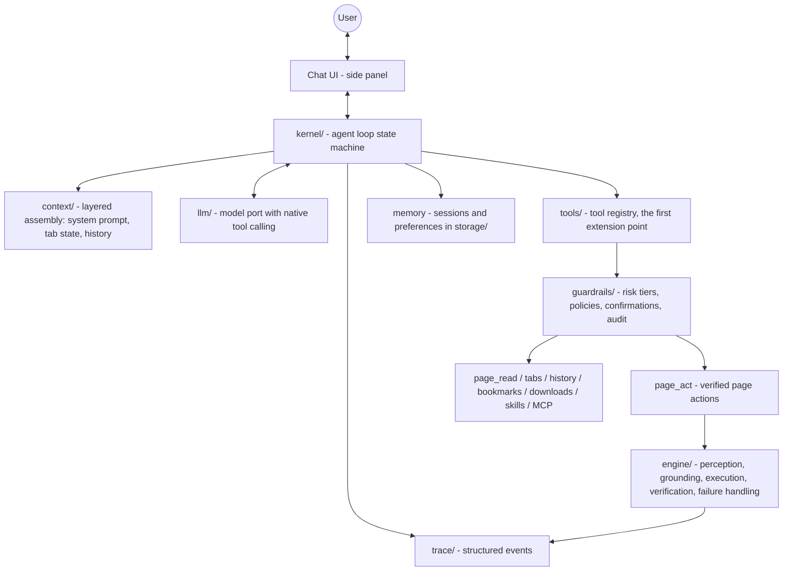

# Architecture

**Agent = Model + Harness.** The model is a pluggable component the user brings; this repository is the harness — everything else. This document describes the harness's anatomy and the invariants that hold it together.

Terminology, once and clearly:

- **harness** — the whole product: kernel, context, tools, engine, guardrails, memory, trace, model port.
- **engine** — one component of the harness (`src/engine/`): the page-action runtime (perception → grounding → execution → verification → failure handling), exposed to the agent loop as the `page_act` tool.

## The anatomy

### kernel/ — the heartbeat

One user turn = one run of the loop (`kernel/loop.ts`): assemble context → stream the model with the tool catalog (`chatWithTools`) → text deltas go straight to the UI; tool calls go through the guardrailed registry → results feed back as tool messages → repeat, within a per-turn tool budget (8 rounds), abortable at every await. Model failures and aborts land in the transcript as data — the kernel never throws mid-conversation.

The kernel holds two convictions:

- **It never judges page work itself.** Page effects enter the conversation only as `page_act`'s verified results.
- **Intent routing belongs to the model.** Plain text = conversation; a tool call = work. No separate intent classifier to maintain, and community tools extend what "work" means without touching the loop.

### context/ — what the model sees

Layered assembly (`context/assemble.ts`), cheapest cache position first:

1. **Base system prompt** — harness identity and tool-use rules, notably that page changes go through `page_act` and its verified result.
2. **Environment** — current tab, open tabs, time, locale; re-rendered fresh every turn.
3. **History** — the persisted session replayed as provider turns (text ↔ tool call ↔ tool result).

### tools/ — the first extension point

A tool is one `ToolDefinition` (`kernel/contracts/tool.ts`): id, description, Zod params schema, risk tier, optional chrome permissions, handler. The registry (`tools/registry.ts`) derives each provider's JSON-Schema tool spec from the Zod schema, and wraps every execution in: params validation → guardrails gate → on-demand permission request → execution → audit. Tool failures are returned as structured tool results the model can react to.

Built-in packs: **page** (`page_act`, `page_read`, `page_screenshot`), **tabs**, **browser data** (history / bookmarks / downloads, using `optional_permissions` requested on first use), **skills** (`skills_run`, `batch_start` — deterministic replay), and the **MCP mount** (`tools/mcp/`): a minimal JSON-RPC 2.0 / Streamable-HTTP client (initialize, tools/list, tools/call — no SDK) that mounts remote tools under `mcp_<name>_*` with the same guardrails.

### engine/ — verified page actions

The engine implements `page_act`. The kernel does not perform page actions directly; it receives the engine's verified result and adds that result to the conversation.

**Closed agent loop** (`engine/orchestrator/agent-loop.ts`) — free-form goals. Each turn: fresh whole-page snapshot (plus page signals: open dialogs, validation errors, live toasts) → the model decides one action with expected post-conditions → adapter-aware execution → post-conditions verified against the live DOM → evidence goes back into the next turn. Transient model failures back off and re-ask; a model repeating a failing action gets a stagnation notice; if an action unloads the document, the transport marks it, the engine waits for the new document and verifies there.

**Compiled plan replay** (`engine/orchestrator/run.ts`) — skills & batch. Pre-bound steps, per-step verification, diagnosis-driven retry chains, budgeted retries, delta anchoring and an idempotency guard. Deterministic replay is what lets batch runs report only what the page confirms.

Layers inside the engine (all under `engine/page/`, self-contained, zero `chrome.*`):

- **Perception** — whole-page semantic graph: full DOM walk including open shadow roots and same-origin iframes; role/name/value/interactivity/occlusion per node; readiness signals (MutationObserver quiet window + in-flight request counting) instead of fixed sleeps.
- **Grounding** — semantic fingerprints (role + name + attrs + structure + anchors) re-locate elements across re-renders, with confidence scoring and re-perception on miss.
- **Execution** — adapter-aware actions through a pluggable channel: `dom` (React/Vue-compatible native event sequences) or `cdp` (`chrome.debugger` for coordinate input and file uploads).
- **Verification** — the signature layer. Post-conditions (`value_equals` / `element_exists` / `url_matches` / `text_present` / `list_count_delta` / `element_state` / …) evaluated against the live DOM with `{passed, expected, actual, evidence}`. `list_count_delta` snapshots a baseline before the action — this catches "toast says success, database says nothing".
- **Failure handling** — diagnose (not found / occluded / value not applied / no signal / flaky) → strategy chain (smart wait, re-ground, scroll probe, dismiss overlay, switch adapter/channel, replan) within hard budgets, then return a failed result with evidence.

### guardrails/ — every tool call passes here

Two gates, one philosophy:

- **Tool gate** (`guardrails/tool-gate.ts`): per-tool authorization memory (ask / always-allow / block), risk tiers (`read` flows, `act` rides site policies, `dangerous` confirms), site allow/block lists.
- **Action gate** (`guardrails/security.ts`): dangerous-pattern detection (submit / pay / delete / send, bilingual) on individual page actions inside `page_act`.

Optional chrome permissions (`history`, `bookmarks`, `downloads`) are declared per tool and requested on first use through a UI gesture. Everything lands in the audit log.

### llm/ — the model port

`LLMProvider` implementations for OpenAI-compatible (streaming tool calls over SSE), OpenAI Responses, Anthropic (tool_use blocks), plus the deterministic mock. Endpoints that reject native `tools` (older Ollama models, thin gateways) degrade automatically to a prompted-JSON protocol with lenient parsing — same `ChatWithToolsResult` shape either way. The engine's structured-output path (plans, decisions) rides the same port.

Test builds (`VITE_USE_MOCK=1`) route to a scripted mock: playbook rules map user input to text turns and tool-call sequences, so the full chat loop runs deterministically with no key.

### Runtime topology

- **The kernel and engine orchestrator live in the side panel**, not the background service worker — MV3 workers sleep at will. The side panel is stable while open, messages content scripts directly, and can attach `chrome.debugger`.
- **The content script hosts the engine's page agent** and answers the typed bridge protocol (`snapshot / resolve / execute / verify / waitReady / …`).
- **The background worker is glue**: onboarding, side-panel behavior, tab queries. No state.
- The engine is chrome-free and bundles into an IIFE for tests and the benchmark, so tests and releases use the same engine implementation.

## Invariants (do not break)

1. Observed page state takes priority over model predictions; snapshot diffs can override expected post-conditions.
2. The model does not decide success for page actions; success requires live-DOM verification.
3. Verification fallbacks must use stronger page evidence, not looser checks.
4. One action per engine turn, fresh whole-page snapshot each turn.
5. Navigation during an action is handled by waiting for the new document and verifying there.
6. **Every claimed page effect must originate from `page_act`'s verified result.**
7. **Every tool call passes the guardrails gate and lands in the audit log.**
8. Contracts are Zod schemas (`kernel/contracts/`, `engine/contracts/`) — change the schema first; keep model-facing schemas null-tolerant.

## Storage model (session-centric)

`chrome.storage.local` via typed repos (`storage/repos.ts`): `sessions` (index) + `session:{id}` (transcripts, capped at 50) · `runs` (RunRecords now carry `sessionId`/`toolCallId` provenance) · `trace:{runId}` · `skills` · `batches` · `providers` · `settings` (general + guardrails incl. per-tool policies + MCP servers) · `audit`. No backend, no telemetry; export/import covers everything.

## Failure modes & test hooks

| Layer | Typical failure | Exposed by | Tested in |
|---|---|---|---|
| kernel | tool-call loops, budget exhaustion | turn budget + transcript errors | ext-e2e chat scenarios |
| context | stale environment | fresh per-turn render | ext-e2e |
| tools | invalid params, permission denial | structured ToolResult summaries + audit | ext-e2e confirm/permission flows |
| engine L1–L6 | missed elements, wrong grounding, fake success, heal loops | trace events + verification evidence | `pnpm test:engine` (31 checks) |
| skills/batch | report does not match page state | report vs DOM cross-check | batch delivery bench |

Run them: `pnpm test:engine` (31 checks) · `pnpm test:e2e` (extension-level, mock model) · `pnpm bench` (vs baseline). Real-model suites: `pnpm test:real` / `pnpm test:sites` (bring your own key; always production builds).

## Security & privacy

Local-first by construction: perception, execution and verification all happen inside the user's browser with their existing sessions. The model receives semantic summaries only, via the user's own API key, straight to the provider they chose. Keys live in `chrome.storage.local`. There is no backend.
